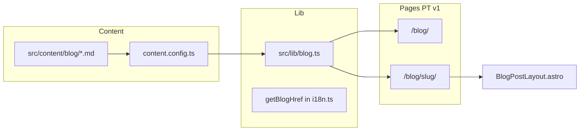

# Blog Roadmap

Execution reference for adding a frontmatter-driven blog to AI-Native Engineers. Blog posts are plain **Markdown (`.md`)** files, not MDX. Sessions remain MDX; do not conflate the two content types. This document is the source of truth for scope, order, acceptance criteria, and risks. Implementation code follows this file; if code and this doc disagree, update one or the other before merging.

We ship one phase at a time. Each phase is validated before the next starts. No skipping ahead, no half-finished work leaking forward.

---

## Decisions (locked)

| Decision | Choice | Notes |
| --- | --- | --- |
| URL | `/blog/` | English routes later: `/en/blog/` |
| v1 locale | PT-BR only | English is Phase 8, after PT v1 ships |
| Content format | Markdown (`.md`) + frontmatter | Content Collections + Zod (same infra as sessions; sessions stay MDX) |
| Collection | Separate `blog` collection | Do not extend `sessions`; different schema, layout, and file type |
| Layout | `BlogPostLayout.astro` | Lighter than `SessionLayout.astro`; no SectionNav, ProgressTracker, NextSessionCTA, ReferencesList |
| CMS | None | Repo + `.md` files; PR is the publishing workflow |
| Reading time | Manual in frontmatter (optional) | Match sessions pattern; no auto-calculation in v1 |

---

## Architecture



**Key files (by phase):**

| Phase | Files created or touched |
| --- | --- |
| 1 | `src/content.config.ts`, `src/content/blog/` |
| 2 | `src/lib/blog.ts`, `src/lib/i18n.ts` |
| 3 | `src/layouts/BlogPostLayout.astro` |
| 4 | `src/pages/blog/[slug].astro` |
| 5 | `src/pages/blog/index.astro` |
| 6 | `src/pages/index.astro` or `src/components/Footer/Footer.astro` |
| 7 | `src/content/blog/*.md` (real post) |
| 8 | `src/pages/en/blog/`, schema extension |

---

## Development order

Phases are sequential. Dependencies flow top to bottom.

```
Phase 1  Collection and Schema
    ↓
Phase 2  Helpers and i18n
    ↓
Phase 3  Post Layout
    ↓
Phase 4  Post Route (PT)
    ↓
Phase 5  Blog Index (PT)
    ↓
Phase 6  Discovery and SEO
    ↓
Phase 7  First Real Post        ← PT v1 complete
    ↓
Phase 8  English (post-v1)
```

**v1 milestone:** Phase 7 done. Phase 8 and backlog items are explicitly post-v1.

---

## Risks and mitigations

| Risk | Impact | Mitigation | Phase |
| --- | --- | --- | --- |
| Blog posts mixed into sessions collection | Wrong template, wrong nav, curriculum pollution | Dedicated `blog` collection and routes under `/blog/` | 1 |
| Draft posts published by mistake | Unfinished content goes live | `draft: true` default in sample; filter `draft === false` in `getStaticPaths` and index | 1, 4, 5 |
| Layout inherits session-only UI | Bloated pages, confusing UX | Explicit exclusion list in Phase 3; no imports from SessionLayout zones | 3 |
| Prose styles diverge from sessions | Inconsistent reading experience | Copy `.session-content` prose rules once into `.blog-content`; do not fork later without reason | 3 |
| Blog confused with aulas (lessons) | Editorial and navigation blur | Distinct URL, layout, file type (`.md` vs `.mdx`), and tone; Phase 7 review against `TONE.md` | 7 |
| MDX used for blog by default | Unnecessary complexity for prose-only posts | Loader accepts `**/*.md` only in v1; MDX reserved for backlog if a post needs React islands | 1 |
| Blog unreachable after launch | Zero traffic | Phase 6 entry point (home or footer); validate ≤2 clicks | 6 |
| Invalid frontmatter breaks production build | Deploy failure | Zod schema in Content Collections; test by breaking frontmatter in Phase 1 | 1 |
| i18n added too early | Scope creep, duplicate work | PT-only until Phase 7 ships; EN in Phase 8 | 8 |
| Empty index with all drafts | Broken-looking `/blog/` | Empty-state copy in Phase 5; document that at least one `draft: false` post is required for index cards | 5 |
| Sitemap or OG tags missing | Poor discoverability and sharing | Phase 6 explicit checks on `dist/sitemap*.xml` and `<meta>` tags | 6 |

---

## Phase 1: Collection and Schema

**Objective:** Register blog posts as a validated Content Collection, separate from sessions.

### What We Ship

- [ ] `blog` collection in `src/content.config.ts` with `glob` loader (`pattern: '**/*.md'`, `base: './src/content/blog'`)
- [ ] Zod schema: `title`, `slug`, `lang` (`pt-BR` | `en`), `description`, `publishedAt`, `updatedAt` (optional), `draft` (default `false`), `tags` (default `[]`), `author` (default `'AI-Native Engineers'`)
- [ ] `translationKey` (optional string) in schema for Phase 8, unused in v1
- [ ] Directory `src/content/blog/`
- [ ] One sample post `.md` with `draft: true`

### Done When

- `npm run build` passes with no errors
- Invalid frontmatter (missing field or wrong type) fails the build
- Sample post is returned by `getCollection('blog')`

### How to Validate

```bash
npm run build
npm run lint
```

- Temporarily remove a required frontmatter field from the sample post; confirm build fails
- Restore the sample post; confirm build passes

---

## Phase 2: Helpers and i18n

**Objective:** Centralize blog query logic and URL helpers before building pages.

### What We Ship

- [ ] `src/lib/blog.ts` with:
  - `getPublishedPosts(lang)` — filters `draft === false`, sorts `publishedAt` descending
  - `getPostBySlug(lang, slug)` — safe lookup, returns `undefined` if not found or draft
- [ ] `getBlogHref(lang, slug?)` in `src/lib/i18n.ts` (mirrors `getSessionHref`)
- [ ] PT-BR UI strings in `ui['pt-BR']`: blog breadcrumb label, published date label, tags label

### Done When

- `npm run build` and `npm run lint` pass
- `getPublishedPosts('pt-BR')` returns an empty array when only draft posts exist
- `getBlogHref('pt-BR')` resolves to `/blog/`
- `getBlogHref('pt-BR', 'my-slug')` resolves to `/blog/my-slug/`

### How to Validate

```bash
npm run build
npm run lint
```

- Confirm href helpers account for `BASE_URL` via existing `withBase()` pattern

---

## Phase 3: Post Layout

**Objective:** A lightweight post template that reuses site chrome without session-specific UI.

### What We Ship

- [ ] `src/layouts/BlogPostLayout.astro`
- [ ] Reuse: `BaseLayout`, `SectionBlock`, `Breadcrumbs`, `Badge`, `Footer`
- [ ] Do **not** include: `SectionNav`, `ProgressTracker`, `NextSessionCTA`, `ReferencesList`, `Discussion`
- [ ] Prose styles copied from `.session-content` in `SessionLayout.astro` into `.blog-content`
- [ ] Hero: title, `description`, `publishedAt` (and `updatedAt` when present), tags

### Done When

- Layout compiles with all required props
- Prose is readable at 375px and 1024px (headings, lists, blockquote, code, tables)
- `<title>` and meta description come from frontmatter
- Breadcrumb trail: Home → Blog → Post title

### How to Validate

- Wire layout in Phase 4 (or a temporary dev-only route) and open a post in the browser
- View Source: confirm `<title>`, `meta name="description"`, and breadcrumb markup
- Resize viewport to 375px and 1024px

---

## Phase 4: Post Route (PT)

**Objective:** Serve published PT-BR posts at static `/blog/{slug}/` URLs.

### What We Ship

- [ ] `src/pages/blog/[slug].astro`
- [ ] `getStaticPaths`: only posts where `lang === 'pt-BR'` and `draft === false`
- [ ] `render(post)` + `BlogPostLayout` + `<Content />`
- [ ] Sample post flipped to `draft: false`

### Done When

- `/blog/{slug}/` renders full Markdown body
- Unknown slug returns the existing 404 page
- Posts with `draft: true` do not generate a static route
- View Source shows static HTML content (no JS required for body text)

### How to Validate

```bash
npm run dev
```

- Open `/blog/{slug}/` for the sample post
- Open `/blog/nonexistent-slug/` and confirm 404
- View Source on the post page

---

## Phase 5: Blog Index (PT)

**Objective:** List published posts chronologically at `/blog/`.

### What We Ship

- [ ] `src/pages/blog/index.astro`
- [ ] Post cards via existing `Card.astro`: title, description, date, tags
- [ ] Index hero: "Blog" heading plus one line of editorial context
- [ ] Empty state message when zero published posts exist

### Done When

- `/blog/` lists posts newest first
- Each card links to `/blog/{slug}/`
- Draft posts never appear on the index
- Layout is mobile-first and visually consistent with Neo Brutalism

### How to Validate

```bash
npm run dev
```

- Open `/blog/` with one published post
- Add a second published post with an earlier `publishedAt`; confirm sort order
- Set all posts to `draft: true`; confirm empty state renders

---

## Phase 6: Discovery and SEO

**Objective:** Make the blog findable without typing the URL and shareable with correct previews.

### What We Ship

- [ ] One entry point to `/blog/`: home page section **or** footer link (pick at implementation time; record the choice in a comment or this doc)
- [ ] Per-page OG tags via `BaseLayout` (title + description on index and posts)
- [ ] Confirm `@astrojs/sitemap` includes `/blog/` and post URLs after build

### Done When

- User reaches the blog from the home page in at most 2 clicks
- Sharing a post produces correct title and description in OG meta
- `dist/sitemap*.xml` lists `/blog/` and each published post URL

### How to Validate

```bash
npm run build
```

- Click from home (or footer) to `/blog/`
- Inspect `<meta property="og:title">` and `og:description` on index and a post
- Open `dist/sitemap-0.xml` (or equivalent) and search for `/blog/`

---

## Phase 7: First Real Post

**Objective:** Ship one editorially real PT-BR post that reads as blog content, not curriculum.

### What We Ship

- [ ] Replace the sample post with real Markdown content per `TONE.md`
- [ ] Complete frontmatter: title, slug, description, publishedAt, tags
- [ ] Editorial pass: acronyms explained, no em dashes, blog tone (more timely/opinionated) vs lesson tone (structured curriculum)

### Done When

- Published post has no placeholders or lorem ipsum
- `npm run build` passes and GitHub Pages deploy succeeds
- Post is editorially distinct from the three sessions at `/sessions/`

### How to Validate

- Full read-through against `TONE.md` checklist
- `npm run build`
- Push to main and confirm live URL on GitHub Pages

**PT v1 is complete when Phase 7 passes.**

---

## Phase 8: English (post-v1)

**Objective:** Extend the blog to English with hreflang alternates, matching the sessions i18n pattern.

### What We Ship

- [ ] Posts with `lang: 'en'` and optional `translationKey` linking PT/EN pairs
- [ ] `src/pages/en/blog/index.astro`
- [ ] `src/pages/en/blog/[slug].astro`
- [ ] `alternateLinks` in `BaseLayout` for blog pages (same pattern as sessions)
- [ ] EN UI strings in `ui.en`
- [ ] One EN post (translation or original)

### Done When

- `/en/blog/` and `/en/blog/{slug}/` render correctly
- `<link rel="alternate" hreflang="...">` is correct when `translationKey` matches across locales
- Language switch in the header navigates to the translated post or a sensible fallback

### How to Validate

```bash
npm run dev
```

- Browse `/en/blog/` and an EN post
- Inspect `<head>` for alternate links
- Toggle language in the site header from a PT post with an EN translation

---

## Post-v1 backlog

Not in scope until PT v1 (Phase 7) ships:

| Item | Notes |
| --- | --- |
| RSS feed | `@astrojs/rss` at `/blog/rss.xml` |
| Giscus comments | Reuse `Discussion.astro` with term `page:blog:pt-BR:{slug}` |
| Tag filter page | Only when post volume justifies it |
| Pagination | Only when index exceeds ~10–15 posts |
| Headless CMS | Out of scope; `.md` files in repo is the workflow |
| MDX for a single post | Only if a post needs embedded React islands; default format stays `.md` |
| Auto reading time | Keep manual optional field like sessions |

---

## Out of scope (this roadmap)

- Changes to existing sessions, harness chapters, or `/projeto` content
- Refactoring `ROADMAP.md` (main site roadmap; separate document)
- Newsletter, auth, search, or gamification

---

## Phase format reference

Every phase in this document follows the same structure:

| Section | Purpose |
| --- | --- |
| **Objective** | Why the phase exists (intent) |
| **What We Ship** | Concrete deliverables (scope) |
| **Done When** | Testable acceptance criteria |
| **How to Validate** | Commands, URLs, and manual checks to confirm done |

Do not mark a phase complete until every **Done When** item passes.
