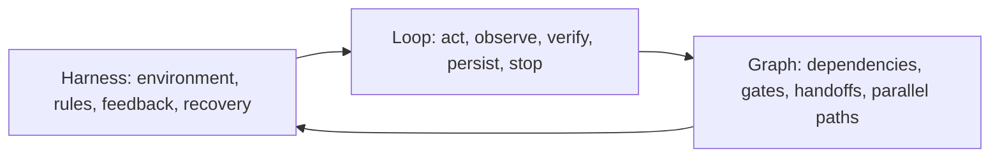

# Engineering Series GOAL

Status: Planned. Implementation has not started.

Last updated: 2026-08-09

Owner: AI-Native Engineers

This is a living, self-contained execution plan for replacing the current blog
post pair with a three-part educational series about Harness Engineering, Loop
Engineering, and Graph Engineering. Keep `Progress`, `Surprises & Discoveries`,
`Decision Log`, and `Outcomes & Retrospective` current during execution.

## Purpose

Replace the current standalone article with a coherent series that helps junior
and mid-level software engineers understand how agentic software work moves from
a useful model call to a controlled engineering system.

The series must make one progression visible:

1. A harness defines the environment and rules within which an agent works.
2. A loop defines how the agent acts, observes, verifies, persists state, and
   decides whether to continue.
3. A graph defines how deterministic steps, tools, people, agents, and complete
   loops connect into a larger execution system.

This progression is an editorial teaching device. It is not presented as an
industry-standard maturity model, and Graph Engineering is not presented as a
replacement for Loop Engineering.

## Claude Code `/goal` invocation

Claude Code v2.1.139 or later supports `/goal`. The command keeps a session
working until a separate evaluator decides that the stated completion condition
has been demonstrated in the conversation. The evaluator does not inspect files
or run commands itself, so every required check must be run and its evidence must
be surfaced before completion.

Start from the repository root and paste this command:

```text
/goal Implement ENGINEERING-SERIES-GOAL.md completely. The goal is achieved only when every Definition of Done item is satisfied with current evidence; the existing PT-BR and English post files have been removed; their public URLs preserve readers through intentional redirects to the new Harness Engineering article; six localized Markdown files exist as three PT-BR and English article pairs; typed series metadata and navigation produce Harness Engineering -> Loop Engineering -> Graph Engineering in both locales; the maturity lesson links, legacy Harness wording, source records, TONE.md, and BLOG-ROADMAP.md are coherent; visible publication dates match frontmatter; formatting, lint, static build, diff checks, source-link checks, sitemap checks, hreflang checks, tone scans, and browser checks pass; no unrelated files are changed; and the execution evidence, decisions, surprises, and retrospective are recorded in ENGINEERING-SERIES-GOAL.md. Do not commit, push, deploy, or change publication workflow without explicit owner authorization. If repository evidence conflicts with this plan or a material decision lacks evidence, stop and ask instead of guessing.
```

The condition is intentionally measurable, names the checks that prove it, and
states the constraints that must survive the work. `/goal` does not broaden
permissions. Approval is still required for any action not already authorized.

## Observable end state

When this GOAL is complete:

- the blog contains three concepts and six locale files, with one PT-BR and one
  English article for each concept;
- the old post pair no longer exists as editorial content;
- both old public URLs lead readers to the corresponding new Harness Engineering
  opening article instead of becoming dead links;
- the series is visibly identified and can be read in the intended order without
  returning to the blog index;
- each article is source-backed, approachable for a reader new to daily agent
  work, and explicit about limitations;
- the site treats Graph Engineering as execution and orchestration graph design,
  not knowledge graphs, GraphRAG, graph databases, or graph neural networks;
- PT-BR and English routes, metadata, alternate-language links, sitemap entries,
  dates, home cards, blog indexes, redirects, and legacy Harness routes remain
  coherent;
- the repository's technical and editorial quality gates pass with recorded
  evidence.

## Reader and editorial outcome

### Primary reader

A junior or mid-level software engineer who knows conventional development
practices but is only beginning to study AI-native engineering and does not yet
use coding agents as part of normal delivery work.

The reader should not need prior knowledge of agent frameworks, model APIs,
multi-agent systems, graph theory, or vendor-specific products.

### What the reader should be able to explain afterward

After article one, the reader can explain why the model is only one component of
an agent system and can identify the minimum useful parts of a harness.

After article two, the reader can sketch a bounded agent loop with external
feedback, persisted state, a budget, and an explicit stop condition.

After article three, the reader can decide when one loop is enough and when an
explicit execution graph adds useful dependencies, gates, parallelism, or human
authority.

### What the reader should be able to try

Each article ends with one small, safe practice that can be tried on the next
local development task:

1. Add one repository-derived guide and one observable check to a harness.
2. Run one small task through a bounded act-check-record loop with a human in the
   loop.
3. Draw the actual workflow as nodes and transitions, then keep only the graph
   structure that removes a real ambiguity or failure mode.

## Repository baseline

The executor must re-check this baseline before editing because paths and
contracts may change after this plan is written.

### Current editorial content

- `src/content/blog/harness-no-dia-a-dia.md` is the current PT-BR post.
- `src/content/blog/harness-in-daily-work.md` is its English counterpart.
- Both use `translationKey: harness-daily-practice`.
- `src/content/sessions/maturidade.mdx` links directly to the PT-BR slug.
- `src/content/sessions/maturity.en.mdx` links directly to the English slug.

The current article is therefore a locale pair, not one isolated file. Removing
only the PT-BR file would break the site's current translation contract.

### Current blog architecture

- The `blog` collection in `src/content.config.ts` accepts plain Markdown and
  validates title, slug, language, description, dates, draft state, tags, author,
  and an optional translation key.
- `src/lib/blog.ts` filters drafts and sorts only by `publishedAt` descending.
- PT-BR and English post routes are generated dynamically.
- The home page in each locale already shows the latest three posts.
- The blog index in each locale already lists all published posts.
- `BlogPostLayout.astro` has no series identity, series navigation, or structured
  reference list.

There is no reliable same-date series ordering today. If three posts share a
publication date, collection order can leak into the visible result. Series
order must be explicit.

### Existing URL contracts

The old blog slugs are already linked from lessons and may be linked externally.
They must not silently become 404 pages.

The separate legacy route tree under `/harness-engineering/` contains fourteen
PT-BR and English redirect pages that lead to the maturity lesson. Preserve all
of those redirects. Do not publish the new series inside that route tree.

The copy on the legacy landing and chapter pages currently says that the Harness
Engineering series was merged or discontinued. That wording will become
ambiguous once a new editorial series starts with the same concept. Update the
copy so it clearly refers to the old chapter-based route tree, not to the new blog
series.

### Documentation state

- `TONE.md` is the voice and narrative source of truth.
- `BLOG-ROADMAP.md` is stale relative to the shipped repository. It still treats
  English as future work, describes the previous visual system, and excludes
  structured references from blog posts.
- `AGENTS.md` requires harness and operational documents, including this one, to
  be written in English.
- The repository has a 400-line changed-line cap for non-content paths in one
  pull request. Files under `src/content/**` are exempt, but unrelated refactors
  remain out of scope.

### Date defect to fix in scope

`publishedAt: 2026-06-01` currently renders as the previous calendar day in the
São Paulo timezone because a date-only YAML value becomes a UTC `Date` and the
formatters do not pin a display timezone. Fix all blog date renderers to use one
explicit, locale-safe policy, then prove that the visible date matches the
frontmatter on article pages, blog indexes, and home cards.

## Scope

### In scope

- Research, outline, write, edit, source, localize, integrate, and validate the
  three-part series.
- Replace the existing PT-BR and English post pair with three PT-BR and three
  English posts.
- Add optional typed series metadata to the blog collection.
- Add explicit series ordering and previous/next navigation.
- Add optional typed reference IDs to blog frontmatter and render the referenced
  source records in the blog layout.
- Add or update reference records for the sources actually used.
- Preserve old blog URLs with intentional static redirect pages and useful
  no-script fallback content.
- Update the two lesson links to the new opening article.
- Disambiguate the old Harness route tree from the new blog series in PT-BR,
  English, and `TONE.md`.
- Reconcile `BLOG-ROADMAP.md` with the implemented state and link it to this GOAL.
- Fix the visible date defect for blog pages, indexes, and home cards.
- Validate PT-BR and English on mobile and desktop, in light and dark themes.
- Record evidence and maintain the living-plan sections in this file.

### Out of scope

- Redesigning the blog, home page, cards, or site navigation.
- Adding an image-generation workflow, decorative illustrations, animations, or
  React islands to these posts.
- Rebuilding the legacy `/harness-engineering/` curriculum.
- Teaching knowledge graphs, GraphRAG, graph databases, or graph neural networks.
- Endorsing one model, coding agent, framework, or vendor as the default choice.
- Claiming a universal Harness -> Loop -> Graph industry maturity model.
- Publishing benchmark or productivity numbers as general facts.
- Adding a CMS, comments, analytics, newsletter flow, or new deployment system.
- Committing, pushing, opening a pull request, merging, or deploying without
  explicit authorization for that action.

## Locked decisions

These decisions come from the current repository contract and the requested
reader journey. Change one only after recording the reason in `Decision Log`.

| Topic                 | Decision                                                                                  | Reason                                                                    |
| --------------------- | ----------------------------------------------------------------------------------------- | ------------------------------------------------------------------------- |
| Series key            | `beyond-the-prompt`                                                                       | Stable, language-neutral identity for queries and navigation.             |
| PT-BR series title    | `Além do prompt`                                                                          | Connects the three layers without inventing an industry taxonomy.         |
| English series title  | `Beyond the prompt`                                                                       | Natural counterpart, not a literal UI workaround.                         |
| Locale scope          | Three PT-BR and three English Markdown files                                              | The current post and routes already have locale parity.                   |
| Publication           | Prepare all six files as drafts, then publish the complete series in one atomic migration | Prevents a half-series from replacing the only current article.           |
| Reading order         | Harness, Loop, Graph                                                                      | Matches the requested arc and the dependency between concepts.            |
| Old blog URLs         | Redirect each locale to the new Harness article in that locale                            | Preserves reader intent and external links.                               |
| Legacy Harness routes | Preserve all existing redirects to the maturity lesson                                    | The old chapter tree and the new blog series are different contracts.     |
| Graph meaning         | Execution and orchestration graph                                                         | Prevents confusion with knowledge graphs and adjacent graph technologies. |
| Sources               | Typed reference IDs in frontmatter plus a rendered source section                         | Keeps claims auditable and sources maintainable.                          |
| Example               | Fixing TypeScript errors in an unfamiliar repository                                      | Familiar to the audience and able to grow across all three articles.      |
| Interaction           | Static prose and existing components only                                                 | The explanation does not require a new interaction.                       |
| Publication date      | One owner-approved calendar date shared by all six posts                                  | Makes the release atomic while series order remains independent of date.  |

The exact publication date is the only content-release value that remains open.
Before flipping `draft` to `false`, ask the owner for the intended date if it has
not already been provided. Do not infer it from the implementation date.

## Working titles and slugs

Titles are editorial working titles. They may be tightened during the read-aloud
pass if the thesis and translation pairing remain unchanged. Slugs are stable
contracts and should not change without an explicit migration decision.

| Part | PT-BR title                                           | English title                                              | Slug in both locale trees |
| ---- | ----------------------------------------------------- | ---------------------------------------------------------- | ------------------------- |
| 1    | Harness Engineering: o sistema em volta do agente     | Harness Engineering: the system around the agent           | `harness-engineering`     |
| 2    | Loop Engineering: como uma boa execução vira processo | Loop Engineering: turning a good run into a process        | `loop-engineering`        |
| 3    | Graph Engineering: como conectar loops sem virar caos | Graph Engineering: connecting loops without creating chaos | `graph-engineering`       |

Expected public routes:

```text
/blog/harness-engineering/
/blog/loop-engineering/
/blog/graph-engineering/
/en/blog/harness-engineering/
/en/blog/loop-engineering/
/en/blog/graph-engineering/
```

Expected retired content URLs that remain as redirects:

```text
/blog/harness-no-dia-a-dia/ -> /blog/harness-engineering/
/en/blog/harness-in-daily-work/ -> /en/blog/harness-engineering/
```

## Terminology contract

### Harness Engineering

Use `harness` for the system surrounding a model and agent run: instructions,
context policy, tools, filesystem and Git access, permissions, sandboxing, hooks,
state, observability, checks, budgets, approval gates, recovery, and handoff
artifacts.

Do not reduce a harness to an `AGENTS.md` file or a prompt. A repository guide is
one part of a harness, and a large guide can make the harness worse when it is
stale, contradictory, or loaded without need.

### Loop Engineering

Use `loop` for the closed execution cycle that reads goal and state, chooses a
bounded next action, uses tools, observes external results, verifies progress,
persists evidence, and then continues, stops, or asks for help.

State clearly that `Loop Engineering` is an emerging label. Official sources
more often use `agent loop`, `evaluator-optimizer`, `control loop`, or named
patterns such as Ralph. Do not present the label as a formal standard.

### Graph Engineering

Use `graph` for the explicit execution topology connecting deterministic code,
model calls, tools, people, agents, and complete loops. Nodes do work. Edges
carry control, data, conditions, dependencies, or authority. Shared state and
checkpoints make the flow inspectable and recoverable.

The first screen of article three must include a plain-language boundary similar
to this, rewritten naturally in the final prose:

> Here, graph means the execution flow between steps and agents. It is not a
> knowledge graph, and it does not replace the loop from the previous article.

Do not describe every execution graph as a directed acyclic graph. Production
agent workflows often contain cycles for retry, clarification, evaluation, and
human approval. A loop is a small cyclic graph; a larger graph can coordinate
several loops.

`Graph Engineering` is a recent name for established workflow ideas. Present it
as an editorially useful label for making flow, dependencies, state, gates, and
handoffs explicit. Do not call it a new era or an agreed successor to loop
engineering.

## Editorial voice contract

The request for an Anthropic/OpenAI educational tone is translated into traits,
not imitation of distinctive wording:

- open with a problem the reader recognizes;
- explain the simple idea before naming the architecture;
- move from a concrete example to technical depth;
- use short titled sections and restrained lists;
- state tradeoffs and failure modes without a dramatic reveal;
- link claims to sources and distinguish observation from interpretation;
- sound confident where evidence is strong and precise where terminology is
  still emerging;
- end with an operation the reader can try, not a motivational summary.

All user-facing copy must also follow `TONE.md`:

- PT-BR is informal, natural, direct, and respectful, without forced slang;
- English is adapted for natural reading, not translated sentence by sentence;
- paragraphs normally contain one idea and two to four sentences;
- sentence length and paragraph rhythm vary intentionally;
- concrete examples appear before abstract definitions;
- acronyms are expanded on first use;
- no em dash character appears in user-facing content;
- use at most one two-beat contrast per article;
- avoid repeated rule-of-three structures, symmetrical contrasts, filler hedges,
  empty intensifiers, and press-release language;
- do not fabricate personal experience, conversations, quotes, or first-person
  stories to make the text sound human;
- vendor names are dated market snapshots, not recommendations;
- use inline citations for specific claims and a source section for further
  reading, without turning the article into an academic paper.

No writing process can guarantee that a reader or automated detector will be
unable to guess how text was produced. AI-detector scores are not an acceptance
criterion. The quality bar is a manual editorial review that finds the prose
specific, varied, honest, source-grounded, and consistent with the site's human
voice.

Target 1,600 to 2,200 PT-BR words per article as planning guidance, not as a hard
gate. Complete the argument without padding. The English version should preserve
the same information architecture and factual claims but may differ in length.

## Continuous example

Use one example across the full series: a team asks an agent to fix TypeScript
errors in an unfamiliar repository.

The example grows one layer at a time:

1. Harness: decide what the agent can read and change, which commands it can run,
   what requires approval, where progress lives, which checks prove success, and
   how a new session resumes safely.
2. Loop: choose one error, inspect it, make the smallest useful change, run the
   type checker and relevant tests, record evidence, then continue or stop under
   an explicit budget.
3. Graph: separate inventory, planning, independent fixes, integration, tests,
   review, and human approval. Send failure back to the node that can act on it
   instead of restarting the entire workflow.

Keep the repository imaginary and technically plausible. Do not invent a case
study, benchmark, employer, or production result.

## Series architecture



The final edge is intentional. Observed graph failures should improve the
harness, so the series closes as a feedback system rather than a one-way ladder.

## Article contracts

### Part 1: Harness Engineering

#### Reader problem

A strong model can still change the wrong files, miss repository rules, declare
success too early, or leave the next session guessing. Improving the prompt does
not solve missing tools, permissions, checks, state, or recovery.

#### Core thesis

The model generates candidate decisions. The harness shapes what it can see and
do, then exposes enough external feedback to make the work controllable,
observable, and recoverable.

#### Pre-AI parallels

- runtime and development environment;
- framework and infrastructure adapters;
- operating-system permissions and process isolation;
- CI pipeline and test harness;
- policy checks, audit logs, and operational runbooks.

Explain the continuity first. Then explain the difference: the component choosing
actions is probabilistic, so ambiguous instructions and weak feedback become
runtime behavior rather than compile-time errors.

#### Required content

- the equation `agent = model + harness` in plain language;
- guides and feedforward versus sensors and feedback;
- context selection and progressive disclosure;
- tools, filesystem, Git, permissions, sandbox, and approvals;
- deterministic checks such as type checking, tests, lint, and browser evidence;
- progress artifacts, checkpoints, traceability, and recovery across sessions;
- why a harness should grow from observed repository failures instead of copied
  configuration;
- why more instructions, skills, tools, or subagents can degrade a system;
- the TypeScript example at the harness layer;
- one small practice the reader can try.

#### Where it breaks

- The harness cannot make a model correct.
- Broad permissions increase the blast radius of a wrong decision.
- Instructions are probabilistic and can be ignored or misapplied.
- Stale guidance poisons context.
- The same model acting and judging can repeat its own blind spot.
- Added machinery increases cost, latency, and failure surface.

#### Minimum source set

- Anthropic on effective harnesses for long-running agents.
- Anthropic on agent evaluation and context engineering.
- OpenAI on agent execution, traces, and evaluations.
- Addy Osmani on deriving harness constraints from observed failures.
- AI Hero on agent-friendly codebases and concise repository guidance.
- One Kimi or Z.ai source showing concrete tools, permissions, or recovery.

### Part 2: Loop Engineering

#### Reader problem

One good agent run is a useful event, not a repeatable process. Without state,
external feedback, a budget, and a stop rule, repeating the prompt can produce a
costly loop that drifts or congratulates itself.

#### Core thesis

Loop engineering turns agent work into a bounded control cycle. The agent chooses
an action, but the environment supplies the evidence that decides whether the
system advances.

#### Pre-AI parallels

- edit, compile, test;
- test-driven development and red-green-refactor;
- a CI job or queue worker;
- retries with backoff;
- a control loop or Kubernetes reconciler;
- Plan-Do-Check-Act, used carefully as an analogy rather than an identity.

The key difference is that the next action is chosen probabilistically. The loop
therefore needs stronger external oracles, explicit state, and budgets than a
normal deterministic `while` loop.

#### Required content

- goal and current state;
- one bounded task per iteration;
- action through a tool;
- observation from the real environment;
- independent verification where practical;
- progress log, task state, Git checkpoint, and clean handoff;
- stop on success, budget exhaustion, repeated failure, or required human
  judgment;
- context reset and recovery between sessions;
- human-in-the-loop first, unattended execution only when risk and evidence allow;
- the TypeScript example at the iterative layer;
- one small practice the reader can try.

#### Where it breaks

- no stop condition or iteration cap;
- a `done` claim accepted as proof;
- tests that do not cover the intended behavior;
- blind retry that repeats the same action;
- context growth and drift;
- irreversible, financial, production, or real-data actions without human
  authority;
- a repository whose existing patterns teach the loop the wrong behavior.

#### Minimum source set

- Anthropic on evaluator-optimizer patterns and long-running incremental work.
- Anthropic's coding experiment as a bounded case, not a universal recipe.
- OpenAI on the agent execution loop and evaluation traces.
- Kimi's Ralph loop example or Z.ai's goal control loop.
- Addy Osmani on loop engineering and self-improving coding agents.
- AI Hero on Ralph, tracer bullets, and TypeScript feedback loops.

### Part 3: Graph Engineering

#### Reader problem

A single loop becomes hard to reason about when work has dependencies, different
permissions, parallel branches, independent reviewers, or human gates. Adding
more agents without an explicit topology multiplies coordination cost and hidden
state.

#### Core thesis

Graph engineering makes the execution topology explicit. It assigns
responsibility to nodes, meaning to transitions, structure to shared state, and
authority to gates. It combines deterministic control with agent autonomy only
where each adds value.

#### Pre-AI parallels

- flowcharts and finite-state machines;
- build and dependency graphs;
- CI/CD pipelines;
- job and workflow orchestrators;
- actor systems and message passing;
- directed acyclic graphs, while explaining why many agent graphs contain cycles.

#### Required content

- the execution-graph boundary on the first screen;
- nodes as deterministic code, model calls, tools, humans, agents, or loops;
- edges as fixed or conditional transitions carrying data, control, dependency,
  or authority;
- state, checkpoints, branches, joins, retries, fan-out, fan-in, and handoffs;
- manager-owned orchestration versus transferred control;
- why parallelism requires independent work and explicit ownership;
- why a graph can contain loops and why a loop does not become obsolete;
- when an open-ended harness is better than a predefined graph;
- the TypeScript example as explorer -> planner -> independent fixers ->
  integrator -> tests -> reviewer -> human approval;
- one small practice the reader can try;
- a closing return to human ownership of verdicts and the outer loop.

#### Where it breaks

- graph structure added before a real dependency or failure exists;
- too many nodes, prompts, traces, handoffs, and approval points;
- parallel agents changing shared mutable areas;
- a manager becoming the bottleneck;
- handoffs losing constraints, decisions, or evidence;
- tests passing while human comprehension debt grows;
- vendor swarm benchmarks generalized beyond their experimental setup.

#### Minimum source set

- Anthropic on routing, parallelization, orchestrator-workers, and multi-agent
  research.
- OpenAI on multi-agent fit, handoffs, agents as tools, and deterministic graphs.
- Kimi and Z.ai sources on subagents, swarms, permissions, and limitations.
- Addy Osmani on software factories, agent orchestras, the outer loop, and
  cognitive parallelism.
- LangChain's primary explanation that loops are cyclic graphs and graphs are
  useful only when workflow structure is knowable.

## Source policy

### Evidence hierarchy

Use sources in this order:

1. Official engineering posts, product documentation, code repositories, and
   research from the company that built the discussed system.
2. Practitioner writing that explains an observed workflow and exposes its
   limits.
3. Vendor framing or recent terminology used only to describe the current market
   conversation.

For each factual note in the research outline, record:

- the claim in the article's own words;
- the supporting URL;
- source type and publication or retrieval date;
- whether it is a documented mechanism, an experiment, a vendor claim, a
  practitioner opinion, or the site's editorial synthesis;
- the article section that uses it.

Never cite a search-result snippet. Open the canonical source. Prefer a stable
documentation or repository URL over a social post when they support the same
claim. Re-check every final link near publication because vendor docs change.

### Primary source ledger

The following is the starting ledger, not a requirement to cite every source in
every article. Keep only sources that materially support the final text.

#### Anthropic

| Source                                                                                                                           | Use                                                                                             |
| -------------------------------------------------------------------------------------------------------------------------------- | ----------------------------------------------------------------------------------------------- |
| [Effective harnesses for long-running agents](https://www.anthropic.com/engineering/effective-harnesses-for-long-running-agents) | Incremental work, state across sessions, Git, testing, recovery, and premature completion.      |
| [Harness design for long-running apps](https://www.anthropic.com/engineering/harness-design-long-running-apps)                   | Planner, generator, evaluator, verifiable criteria, structured handoffs, and coordination cost. |
| [Building effective agents](https://www.anthropic.com/engineering/building-effective-agents)                                     | Start simple, add complexity when measured, and compare workflow topologies.                    |
| [Demystifying evals for AI agents](https://www.anthropic.com/engineering/demystifying-evals-for-ai-agents)                       | Agent harness versus evaluation harness, outcomes, traces, and graders.                         |
| [Effective context engineering for AI agents](https://www.anthropic.com/engineering/effective-context-engineering-for-ai-agents) | Curating useful context instead of maximizing context volume.                                   |
| [How we built our multi-agent research system](https://www.anthropic.com/engineering/multi-agent-research-system)                | Lead-worker orchestration, parallel research, synthesis, and limits.                            |
| [Building a C compiler with agents](https://www.anthropic.com/engineering/building-c-compiler)                                   | A specific long-running coding experiment, clearly labeled as a case.                           |
| [Keep Claude working toward a goal](https://code.claude.com/docs/en/goal)                                                        | The execution mechanism and completion-condition design for this plan.                          |

#### OpenAI

| Source                                                                                                              | Use                                                                                                         |
| ------------------------------------------------------------------------------------------------------------------- | ----------------------------------------------------------------------------------------------------------- |
| [Build agents](https://developers.openai.com/api/docs/guides/agents)                                                | Tools, state, guardrails, human review, traces, and evals around a model.                                   |
| [Run agents](https://developers.openai.com/api/docs/guides/agents/running-agents)                                   | Agent loop, tool continuation, handoff, final output, state, and failure handling.                          |
| [Orchestrate multiple agents](https://developers.openai.com/api/docs/guides/agents/orchestration)                   | Handoffs versus manager-owned agents-as-tools.                                                              |
| [Multi-agent](https://developers.openai.com/api/docs/guides/responses-multi-agent)                                  | Parallel bounded work, focused context, shared-state contention, and cases that need a deterministic graph. |
| [Agent evals](https://developers.openai.com/api/docs/guides/agent-evals)                                            | Traces, datasets, graders, and repeatable evaluation.                                                       |
| [Evaluation best practices](https://developers.openai.com/api/docs/guides/evaluation-best-practices)                | Specific criteria, continuous evaluation, and limits of model-based judgment.                               |
| [Harness engineering](https://openai.com/index/harness-engineering/)                                                | Existing repository reference for agent-first engineering. Re-verify claims and date before use.            |
| [Open-source Codex orchestration with Symphony](https://openai.com/index/open-source-codex-orchestration-symphony/) | Existing repository reference for orchestration. Treat product details as a dated snapshot.                 |

#### Moonshot AI and Kimi

| Source                                                                                              | Use                                                                                     |
| --------------------------------------------------------------------------------------------------- | --------------------------------------------------------------------------------------- |
| [Kimi Agent SDK](https://github.com/MoonshotAI/kimi-agent-sdk)                                      | Runtime, sessions, tools, skills, Model Context Protocol, approvals, and orchestration. |
| [Kimi Code tools reference](https://www.kimi.com/code/docs/en/kimi-code-cli/reference/tools.html)   | Tool permissions, subagents, background tasks, limits, and context isolation.           |
| [Ralph loop example](https://github.com/MoonshotAI/kimi-agent-sdk/tree/main/examples/go/ralph-loop) | External verification and iteration limits in a concrete loop.                          |
| [Kimi Agent Swarm](https://www.kimi.com/blog/agent-swarm)                                           | Dynamic decomposition and parallel subagents. Label preview status and vendor claims.   |
| [Kimi K2.5](https://github.com/MoonshotAI/Kimi-K2.5)                                                | Experimental multi-agent configurations. Do not generalize benchmark results.           |

#### Z.ai and GLM

| Source                                                                    | Use                                                                                            |
| ------------------------------------------------------------------------- | ---------------------------------------------------------------------------------------------- |
| [ZCode Agent](https://zcode.z.ai/en/docs/agents)                          | Workspace, files, Git, terminal, persistent instructions, and execution modes.                 |
| [Safety and confirmation](https://zcode.z.ai/en/docs/safety-confirm)      | Permissions, risky actions, approval, and resumption.                                          |
| [Agent Framework](https://zcode.z.ai/en/docs/agent-framework)             | Planning, execution, verification, review, and state.                                          |
| [Goal](https://zcode.z.ai/en/docs/goal)                                   | Goal, state, budget, iterations, automatic verification, resumption, and fail-closed behavior. |
| [Subagents](https://zcode.z.ai/en/docs/subagents)                         | Specialist contexts, concurrency, permissions, and documented limits.                          |
| [GLM-5: From Vibe Coding to Agentic Engineering](https://z.ai/blog/glm-5) | Vendor positioning only, not independent proof of capability.                                  |

### Practitioner and terminology ledger

#### AI Hero and Matt Pocock

| Source                                                                                                                                           | Use                                                                                              |
| ------------------------------------------------------------------------------------------------------------------------------------------------ | ------------------------------------------------------------------------------------------------ |
| [How to make codebases AI agents love](https://www.aihero.dev/how-to-make-codebases-ai-agents-love)                                              | Clear interfaces, deep modules, test seams, progressive disclosure, and the codebase as context. |
| [Getting started with Ralph](https://www.aihero.dev/getting-started-with-ralph)                                                                  | PRD, progress state, one task per iteration, checks, and completion signal.                      |
| [11 tips for AI coding with Ralph Wiggum](https://www.aihero.dev/tips-for-ai-coding-with-ralph-wiggum)                                           | Human-in-the-loop first, iteration limits, context reset, and risk.                              |
| [Essential AI coding feedback loops for TypeScript projects](https://www.aihero.dev/essential-ai-coding-feedback-loops-for-type-script-projects) | Type checking, tests, formatting, hooks, and dev-server observation.                             |
| [Tracer bullets: keeping AI slop under control](https://www.aihero.dev/tracer-bullets)                                                           | Small end-to-end slices and fast feedback, connected to established engineering practice.        |
| [A complete guide to AGENTS.md](https://www.aihero.dev/a-complete-guide-to-agents-md)                                                            | Minimal root guidance, progressive disclosure, and stale-document risk.                          |

#### Addy Osmani

| Source                                                                                | Use                                                                                               |
| ------------------------------------------------------------------------------------- | ------------------------------------------------------------------------------------------------- |
| [Agent Harness Engineering](https://addyosmani.com/blog/agent-harness-engineering/)   | Harness components and failure-derived constraints.                                               |
| [Loop Engineering](https://addyosmani.com/blog/loop-engineering/)                     | Trigger, work source, verification, state, budgets, and human responsibility.                     |
| [Self-improving coding agents](https://addyosmani.com/blog/self-improving-agents/)    | Small tasks, checkpoints, resets, maker-checker separation, and stop rules.                       |
| [The code agent orchestra](https://addyosmani.com/blog/code-agent-orchestra/)         | Dependencies, ownership, worktrees, specialist agents, and integrator role.                       |
| [Software factories, light and dark](https://addyosmani.com/blog/software-factories/) | Loops inside harnesses, graph-shaped workflows, verification bottlenecks, and comprehension debt. |
| [Own the outer loop](https://addyosmani.com/blog/own-the-outer-loop/)                 | Human verdict, answerability, evidence, and agency.                                               |
| [Your parallel agent limit](https://addyosmani.com/blog/cognitive-parallel-agents/)   | Cognitive load and comprehension debt from excessive parallelism.                                 |

The requested LinkedIn profile returned HTTP 429 during research on 2026-08-09.
Use Addy Osmani's canonical site for claims. The profile may be revisited for
discovery, but no claim may depend on an inaccessible LinkedIn snippet.

#### Other primary technical explanations

| Source                                                                                                                                 | Use                                                                                             |
| -------------------------------------------------------------------------------------------------------------------------------------- | ----------------------------------------------------------------------------------------------- |
| [Harness engineering for coding agent users](https://martinfowler.com/articles/harness-engineering.html)                               | Guides and sensors as feedforward and feedback.                                                 |
| [Humans and agents in software engineering loops](https://www.martinfowler.com/articles/exploring-gen-ai/humans-and-agents.html)       | Inner and outer loops, shift-left parallels, and human work on the loop.                        |
| [Context engineering for coding agents](https://www.martinfowler.com/articles/exploring-gen-ai/context-engineering-coding-agents.html) | Context curation, rules, tools, skills, subagents, hooks, and overload risk.                    |
| [Three years of Graph Engineering with LangGraph](https://www.langchain.com/blog/3-years-of-graph-engineering-with-langgraph)          | Nodes, edges, state, cycles, loops as graphs, dynamic transitions, and when not to use a graph. |
| [LangGraph Graph API](https://docs.langchain.com/oss/python/langgraph/graph-api)                                                       | Technical definitions of state, nodes, and edges.                                               |
| [Workflows and agents](https://docs.langchain.com/oss/python/langgraph/workflows-agents)                                               | Orchestrator-worker, fan-out, fan-in, and evaluator-optimizer patterns.                         |
| [Ralph Wiggum as a software engineer](https://ghuntley.com/ralph/)                                                                     | Original Ralph framing and its own warnings about nondeterminism and broken output.             |

### Source claim rules

- Treat vendor benchmarks, token counts, speedups, agent counts, and capability
  claims as vendor-reported results from a named setup.
- Do not turn one company's implementation into a universal definition.
- Use current product names only when the product itself matters. Prefer stable
  categories in explanatory prose.
- State when a feature is beta, preview, deprecated, or scheduled for retirement.
- Distinguish `documented mechanism`, `reported experiment`, `practitioner
recommendation`, and `editorial synthesis` in research notes.
- If two sources disagree, describe the boundary or tradeoff. Do not silently
  choose the more convenient claim.
- Re-check dates and live URLs no more than seven days before publication.

## Technical implementation contract

### Frontmatter

Extend the blog schema with two optional fields so existing or future standalone
posts remain valid:

```yaml
series:
  key: beyond-the-prompt
  title: Além do prompt
  order: 1
  total: 3
references:
  - anthropic-effective-harnesses
  - openai-agent-evals
```

The English files use `title: Beyond the prompt`. `key`, `order`, and `total`
must match across each translation pair. Use distinct translation keys per
concept, for example:

```text
beyond-the-prompt-harness
beyond-the-prompt-loop
beyond-the-prompt-graph
```

The Zod shape should require positive integer order and total values. Cross-entry
validation must fail the build or an explicit validation command when a
published series has duplicate orders, missing positions, inconsistent totals,
or a missing locale counterpart.

### Ordering

Keep blog chronology as the primary sort. Add a deterministic tie-breaker:

1. `publishedAt` descending across unrelated releases.
2. Within the same series on the same date, `series.order` ascending.
3. A stable slug comparison as the final fallback.

This produces Harness -> Loop -> Graph on the release date without inventing
three fake publication dates.

### Series navigation

Each series post must show:

- localized series title;
- localized `Part N of 3` label;
- previous and next article links when they exist;
- a stable reading order that does not depend on filesystem enumeration.

The navigation belongs after the article body and before the source section, or
in another location justified by browser inspection. Use an Astro component and
CSS module if the markup is more than a small layout concern. Do not add client
JavaScript or motion.

The home and blog-index cards should identify series membership and part number
with existing typographic patterns. Do not redesign the cards.

### References

Add `references: string[]` to blog frontmatter with an empty default. Resolve IDs
against the existing `references` collection during route generation. A missing
ID must fail loudly during build instead of disappearing from the page.

Reuse `ReferencesList` if browser inspection confirms that its hierarchy works
inside a field essay. Otherwise create a lighter blog-specific wrapper around
the same typed reference data. Record the decision and do not duplicate reference
records inside Markdown.

Only records cited by the final articles need to be added. Do not dump the whole
research ledger onto each page.

### Redirects

After deleting the old Markdown files, create explicit locale-specific static
redirect pages for the two old slugs. Follow the existing legacy Harness redirect
pattern:

- `window.location.replace()` for the canonical target;
- visible fallback copy and a normal link;
- `noindex`;
- correct language and alternate links;
- no redirect chain;
- no target outside the same locale.

Confirm static pages take precedence over the dynamic blog route and inspect the
built HTML. A meta refresh may be added only if the repository's existing static
hosting behavior needs it and accessibility remains intact.

### Dates

Choose one explicit policy for date-only blog frontmatter, preferably rendering
in UTC so the calendar date is stable in every locale and environment. Apply it
to:

- `BlogPostLayout.astro`;
- PT-BR and English blog indexes;
- PT-BR and English home cards;
- any new series component that displays a date.

Verify the exact visible day in built HTML and in the browser. Do not rely only
on successful compilation.

### Localization and metadata

- Every PT-BR post has exactly one English partner through `translationKey`.
- `hreflang` for PT-BR, English, and `x-default` points to the paired article.
- Page title, description, canonical URL, Open Graph metadata, date, tags, and
  source labels match the locale.
- The language switch preserves the concept instead of returning to the index.
- New and redirected URLs have intentional sitemap and canonical behavior.
- Descriptions summarize the reader benefit without repeating the title.

## Expected file inventory

Re-check imports and repository patterns before creating anything. This is the
expected scope, not permission for unrelated cleanup.

### Create

```text
ENGINEERING-SERIES-GOAL.md
src/content/blog/harness-engineering.md
src/content/blog/loop-engineering.md
src/content/blog/graph-engineering.md
src/content/blog/harness-engineering.en.md
src/content/blog/loop-engineering.en.md
src/content/blog/graph-engineering.en.md
src/pages/blog/harness-no-dia-a-dia.astro
src/pages/en/blog/harness-in-daily-work.astro
```

A `BlogSeriesNav` Astro component and CSS module are expected if the existing
layout cannot express the series contract cleanly.

### Remove during atomic migration

```text
src/content/blog/harness-no-dia-a-dia.md
src/content/blog/harness-in-daily-work.md
```

### Modify as needed

```text
BLOG-ROADMAP.md
TONE.md
src/content.config.ts
src/content/references/references.json
src/lib/blog.ts
src/lib/i18n.ts
src/layouts/BlogPostLayout.astro
src/pages/blog/[slug].astro
src/pages/en/blog/[slug].astro
src/pages/blog/index.astro
src/pages/en/blog/index.astro
src/pages/index.astro
src/pages/en/index.astro
src/content/sessions/maturidade.mdx
src/content/sessions/maturity.en.mdx
src/pages/harness-engineering/index.astro
src/pages/harness-engineering/[slug].astro
src/pages/en/harness-engineering/index.astro
src/pages/en/harness-engineering/[slug].astro
```

Do not edit a listed file if the acceptance criteria can be met without changing
it. Add unexpected files to `Decision Log` with the reason before modifying them.

## Delivery and review strategy

Keep the public migration atomic even if review is split:

1. Infrastructure can ship without visible content if all new fields are optional
   and existing behavior remains unchanged.
2. The six article files can be reviewed with `draft: true` while the current post
   remains published.
3. The release change removes the old post pair, adds their redirect pages,
   updates links and legacy wording, flips all six new files to `draft: false`,
   and validates the complete public state together.

If pull requests are used, a safe stacked sequence is:

- PR A: series schema, helpers, layout support, date fix, and documentation;
- PR B: six draft content files and required reference records;
- PR C: atomic publication, old-content removal, redirects, internal-link updates,
  and final evidence.

Keep each PR's non-content diff at or below 400 changed lines. Content lines under
`src/content/**` are exempt from the formal cap, but each article still needs a
focused editorial review. If the owner chooses a different delivery workflow,
record it before implementation. Do not infer authorization to commit, push,
merge, or deploy from this strategy.

## Long-running execution milestones

Complete milestones in order. Each one must leave the repository coherent and
produce evidence that the next session can inspect.

### Milestone 0: Re-establish ground truth and authority

- [ ] Read `AGENTS.md`, `TONE.md`, `BLOG-ROADMAP.md`, and this GOAL completely.
- [ ] Inspect Git status and record pre-existing changes. Do not overwrite them.
- [ ] Re-open the current post pair, their lesson links, blog schema, helpers,
      routes, layout, home cards, indexes, legacy redirects, and source collection.
- [ ] Confirm the execution runtime from `.tool-versions` and use Linux Node
      22.22.2.
- [ ] Confirm the publication date and delivery authority with the owner if not
      already explicit.
- [ ] Re-check source URLs and statuses that may have changed.
- [ ] Update baseline facts in `Surprises & Discoveries` before changing scope.

Evidence: a concise baseline note, clean or fully accounted Git status, confirmed
publication date, and a source ledger with accessible canonical URLs.

### Milestone 1: Reconcile the blog contract

- [ ] Update `BLOG-ROADMAP.md` so it describes the shipped bilingual blog and
      links to this GOAL for the new series track.
- [ ] Update `TONE.md` to distinguish the removed chapter-based Harness route
      tree from the new blog article and series.
- [ ] Add optional typed `series` and `references` fields to the blog schema.
- [ ] Add helpers for deterministic series lookup, order, neighbors, and
      cross-entry validation.
- [ ] Fix the blog date policy across every visible blog surface.
- [ ] Keep current standalone-post behavior valid until the release milestone.

Evidence: format, lint, and build pass with the old post still live; an invalid
temporary series fixture proves duplicate or incomplete series metadata fails;
the fixture is then removed and the clean build passes again.

### Milestone 2: Integrate series and source presentation

- [ ] Add localized series labels and accessible previous/next navigation.
- [ ] Resolve blog reference IDs and render a source section.
- [ ] Fail loudly on a missing source ID.
- [ ] Add restrained series identity to article, home, and index cards as needed.
- [ ] Verify standalone posts without series metadata still render normally.
- [ ] Keep the changes static, keyboard accessible, and JavaScript-free.

Evidence: a temporary or draft series renders ordered navigation and sources in
both locales; keyboard, mobile, theme, and no-JavaScript checks pass.

### Milestone 3: Research notes and PT-BR drafts

- [ ] Build a claim map for all three articles using the evidence hierarchy.
- [ ] Label vendor claims, practitioner advice, and editorial synthesis.
- [ ] Write all three PT-BR files with `draft: true`.
- [ ] Carry the TypeScript example through the full series without contradiction.
- [ ] Add only the reference records actually used.
- [ ] Perform a structural review against each article contract.
- [ ] Perform a factual review against opened primary sources.
- [ ] Perform a read-aloud and anti-pattern review against `TONE.md`.

Evidence: three complete PT-BR drafts, claim maps, accessible source links, no
em dash characters, no unexplained first-use acronyms, and recorded editorial
review notes.

### Milestone 4: English adaptation and locale parity

- [ ] Write three English adaptations with `draft: true`.
- [ ] Preserve technical claims, limitations, example state, source identity, and
      article order without literal sentence-by-sentence translation.
- [ ] Confirm all three translation-key pairs are unique and complete.
- [ ] Review English for natural rhythm and the same evidence level as PT-BR.
- [ ] Confirm localized metadata, source labels, series title, and navigation.

Evidence: six complete draft files, a PT-BR/English parity matrix, valid alternate
links, and no orphaned translation keys.

### Milestone 5: Atomic content migration

- [ ] Create the two old-slug redirect pages and validate their targets.
- [ ] Update the maturity lesson links to the new Harness article.
- [ ] Disambiguate copy on all PT-BR and English legacy Harness redirect pages.
- [ ] Remove the two old Markdown post files.
- [ ] Set the approved publication date on all six new files.
- [ ] Flip all six new files from draft to published in the same change.
- [ ] Confirm no source text still links to the retired content slugs except the
      intentional redirect-page paths or migration documentation.

Evidence: six generated article routes, two generated old-slug redirect routes,
all fourteen legacy Harness redirects preserved, and no dead internal links.

### Milestone 6: Technical, browser, and editorial validation

- [ ] Run the full static quality gate on Linux Node 22.22.2.
- [ ] Inspect generated route files, sitemap, canonical links, metadata, and
      alternate-language links.
- [ ] Validate home, index, each article, both old-slug redirects, and representative
      legacy Harness routes in PT-BR and English.
- [ ] Validate desktop and mobile, light and dark themes, keyboard navigation, and
      reduced motion.
- [ ] Confirm visible dates match frontmatter exactly.
- [ ] Check every rendered source URL and record any inaccessible source.
- [ ] Run editorial scans and then review prose manually. A clean regex is not a
      substitute for a human read.
- [ ] Review the final diff for unrelated changes and the 400-line non-content
      pull-request constraint.

Evidence: commands, exit codes, browser route matrix, screenshots if useful,
source-link report, editorial checklist, and reviewed diff summary.

### Milestone 7: Independent challenge and handoff

- [ ] Have a reviewer who did not write the final draft challenge terminology,
      source support, reader clarity, translation parity, migration safety, and
      completion evidence.
- [ ] Resolve or explicitly record every material finding.
- [ ] Update `Progress`, `Surprises & Discoveries`, `Decision Log`, and
      `Outcomes & Retrospective` with final evidence and residual risks.
- [ ] Confirm no commit, push, merge, or deploy occurred without authorization.
- [ ] Report the exact repository state and the next owner action.

Evidence: independent review notes, resolution record, final validation results,
and a self-contained handoff.

## Definition of Done

The GOAL is complete only when every statement below is true and demonstrated.

### Content and teaching

- [ ] Three complete concepts exist as six PT-BR and English Markdown files.
- [ ] The articles form one intelligible progression without claiming a universal
      industry maturity model.
- [ ] Every article begins with a recognizable problem, explains simply before
      going technical, uses the shared example, includes pre-AI parallels, explains
      failure modes, and ends with one safe practice.
- [ ] Graph Engineering is defined as execution and orchestration graph design on
      the first screen of part three.
- [ ] The Graph article states that loops are not obsolete and that useful graphs
      can contain cycles.
- [ ] Vendor claims and experiments are labeled; no unsupported benchmark or
      productivity number is generalized.
- [ ] No fake personal anecdote, invented quote, or unverifiable case study exists.
- [ ] A factual claim map connects material claims to opened sources.

### Voice and editorial quality

- [ ] PT-BR and English both satisfy `TONE.md`.
- [ ] No user-facing em dash character exists in the six posts or changed labels.
- [ ] Acronyms are expanded on first use.
- [ ] Each article uses no more than one two-beat contrast.
- [ ] Repeated AI-like structures, filler hedges, generic conclusions, and
      press-release phrasing have been removed through manual editing.
- [ ] Both locales have passed a read-aloud review by a human or designated
      independent editorial reviewer.
- [ ] Acceptance does not rely on an AI-detector score.

### Series and localization

- [ ] Series metadata is typed, optional for standalone posts, and valid on all
      six new posts.
- [ ] Published series validation rejects duplicate order, missing order,
      inconsistent total, and missing translation counterpart.
- [ ] Home, blog index, article identity, and previous/next navigation expose the
      intended Harness -> Loop -> Graph order in both locales.
- [ ] Every language switch stays on the equivalent article.
- [ ] PT-BR, English, and `x-default` alternate links are correct.
- [ ] Dates, titles, descriptions, tags, canonical URLs, and source labels match
      each locale.

### Migration and compatibility

- [ ] The old Markdown post pair has been removed.
- [ ] Both old blog URLs resolve to accessible, noindex redirect pages that lead
      directly to the new Harness article in the same locale.
- [ ] Both maturity lessons link directly to the new Harness article.
- [ ] All fourteen existing legacy Harness routes still work and clearly refer to
      the old chapter tree.
- [ ] `TONE.md` and `BLOG-ROADMAP.md` describe the current reality.
- [ ] No unintended 404, redirect chain, orphaned translation key, or stale
      internal link remains.

### Sources

- [ ] Blog frontmatter supports typed source IDs.
- [ ] Each final article renders only the sources it actually uses.
- [ ] Every source ID resolves; missing IDs fail loudly.
- [ ] Every rendered external URL was re-opened near publication.
- [ ] Inaccessible sources are replaced by canonical alternatives or recorded as
      residual risks, never supported by snippets alone.
- [ ] Product, beta, preview, deprecation, and vendor-claim status is current as of
      the publication date.

### Engineering and evidence

- [ ] `npm run format:check` exits 0 on Linux Node 22.22.2.
- [ ] `npm run lint` exits 0 on Linux Node 22.22.2.
- [ ] `npm run build` exits 0 on Linux Node 22.22.2.
- [ ] `git diff --check` exits 0.
- [ ] Built HTML contains the six new article routes and two old-slug redirect
      routes.
- [ ] Sitemap, canonical, Open Graph, and hreflang behavior is intentional.
- [ ] Visible dates equal their frontmatter calendar dates on home, indexes, and
      article pages.
- [ ] Browser checks cover PT-BR and English, desktop and mobile, light and dark,
      keyboard use, reduced motion, and JavaScript-disabled reading.
- [ ] The final reviewed diff contains no unrelated changes and respects the
      non-content PR size rule.
- [ ] The living-plan sections contain current progress, decisions, discoveries,
      evidence, outcomes, and residual risks.

## Validation playbook

Use the Linux runtime named by `.tool-versions`. Do not accidentally run Windows
Node binaries inside WSL.

```bash
source /home/baltz/.nvm/nvm.sh
nvm use 22.22.2
npm run format:check
npm run lint
npm run build
git diff --check
```

The repository currently has no dedicated `test` script. Do not report that tests
passed when only lint and build ran.

### Static artifact checks

After build, confirm:

```text
dist/blog/harness-engineering/index.html
dist/blog/loop-engineering/index.html
dist/blog/graph-engineering/index.html
dist/en/blog/harness-engineering/index.html
dist/en/blog/loop-engineering/index.html
dist/en/blog/graph-engineering/index.html
dist/blog/harness-no-dia-a-dia/index.html
dist/en/blog/harness-in-daily-work/index.html
```

Search built HTML and sitemap files for:

- all six canonical article URLs;
- both intentional old-slug redirects;
- paired `hreflang` values and `x-default`;
- correct localized title and description metadata;
- exact visible publication dates;
- no draft article omission or unexpected legacy removal.

### Browser route matrix

Inspect at least these routes in both 1440px desktop and 390px mobile viewports:

| Surface                | PT-BR                         | English                           |
| ---------------------- | ----------------------------- | --------------------------------- |
| Home                   | `/`                           | `/en/`                            |
| Blog index             | `/blog/`                      | `/en/blog/`                       |
| Series start           | `/blog/harness-engineering/`  | `/en/blog/harness-engineering/`   |
| Series middle          | `/blog/loop-engineering/`     | `/en/blog/loop-engineering/`      |
| Series end             | `/blog/graph-engineering/`    | `/en/blog/graph-engineering/`     |
| Old post               | `/blog/harness-no-dia-a-dia/` | `/en/blog/harness-in-daily-work/` |
| Legacy Harness landing | `/harness-engineering/`       | `/en/harness-engineering/`        |

For every article route, verify title, description, series part, previous/next
links, sources, language switch, date, focus visibility, line length, heading
hierarchy, and footer. Sample all three articles in light and dark themes. Verify
at least one route with JavaScript disabled because the body and navigation are
expected to be static.

### Editorial scans

Run focused searches across the six articles and changed user-facing labels for:

```text
em dash character
TODO or placeholder copy
AI filler phrases listed in TONE.md
unexpanded acronyms
repeated two-beat contrast
stale retired slugs
unsupported superlatives and benchmark percentages
```

Then read every article from top to bottom. Search results can locate patterns,
but they cannot judge rhythm, honesty, pedagogy, or factual fit.

### Source-link checks

Open each final rendered source link. Record HTTP failures, redirects, access
blocks, and retrieval date. For a blocked social profile, find a canonical article
or documentation source that supports the claim. Do not weaken the evidence bar
to keep a preferred name in the source list.

## Risks and mitigations

| Risk                                                | Consequence                                  | Mitigation                                                                                           |
| --------------------------------------------------- | -------------------------------------------- | ---------------------------------------------------------------------------------------------------- |
| Graph Engineering is treated as settled terminology | The site teaches hype as fact                | Declare the term emergent, define the local scope, and cite established workflow mechanics.          |
| The three labels become a fake maturity ladder      | Readers think each layer replaces the last   | Repeat the compositional relationship and close the series as a feedback cycle.                      |
| Vendor material dominates                           | The series becomes product marketing         | Lead with mechanisms, label vendor claims, and cross-check with practitioner or framework sources.   |
| More agents are equated with better engineering     | Readers copy costly orchestration            | Teach one-agent-first design, independence tests, path constraints, and cognitive load.              |
| The prose sounds generated or academic              | Target readers disengage                     | Use a continuous concrete example, varied rhythm, read-aloud review, and no fake human anecdotes.    |
| English is literal translation                      | Voice and examples feel unnatural            | Adapt after PT-BR is stable and review each locale independently.                                    |
| Same-date posts appear out of order                 | The series reads backward on home or index   | Add explicit series order and deterministic tie-breaking.                                            |
| Old links become 404s                               | Existing readers and search results break    | Ship locale-specific static redirect pages in the atomic release change.                             |
| New series conflicts with old Harness copy          | Readers think the new series is discontinued | Name the retired artifact as the old chapter route tree everywhere.                                  |
| Date-only values shift by timezone                  | Publication metadata is visibly wrong        | Pin one timezone policy and inspect built and browser output.                                        |
| Reference IDs drift or disappear                    | Claims lose provenance                       | Validate IDs during build and re-open final URLs near publication.                                   |
| Large mixed change is hard to review                | Regressions and editorial defects hide       | Use draft-first milestones, stacked review, independent challenge, and the 400-line non-content cap. |
| A passing build is mistaken for finished work       | Broken navigation or weak prose ships        | Require browser, link, date, locale, and editorial evidence in addition to build output.             |
| Long-running execution overwrites user work         | Unrelated changes are lost                   | Record initial status, isolate scope, and stop on overlapping edits.                                 |

## Rollback and recovery

Keep the old post pair intact until the six new drafts, series infrastructure, and
redirect pages have passed review. The atomic release change should be reversible
without reconstructing deleted prose from memory.

If the release fails before publication:

1. Keep all new posts as drafts.
2. Leave the old post pair published.
3. Remove or disable unfinished series presentation without touching unrelated
   blog behavior.
4. Record the failure and next safe checkpoint in this file.

If a defect is found after publication and Git rollback is authorized:

1. Revert the release layer that removed the old posts and flipped drafts.
2. Keep compatible optional schema fields if they are proven harmless, or revert
   their dedicated change separately.
3. Restore the old article routes before removing new redirects.
4. Re-run the full quality gate and route matrix.

Never delete generated or source directories broadly. Resolve exact files before
any removal. Do not use destructive Git commands to recover.

## Progress

- [x] (2026-08-09) Audited the current blog pair, links, routes, schema, layout,
      indexes, home integration, legacy redirects, planning docs, and tone guide.
- [x] (2026-08-09) Researched official Anthropic, OpenAI, Kimi, and Z.ai/GLM
      sources plus AI Hero, Addy Osmani, Martin Fowler, Geoffrey Huntley, and
      LangChain sources.
- [x] (2026-08-09) Defined the series arc, terminology boundary, shared example,
      migration contract, source policy, milestones, and Definition of Done.
- [x] (2026-08-09) Created the persistent Claude Code `/goal` execution plan.
- [ ] Milestone 0: Re-establish ground truth and authority.
- [ ] Milestone 1: Reconcile the blog contract.
- [ ] Milestone 2: Integrate series and source presentation.
- [ ] Milestone 3: Research notes and PT-BR drafts.
- [ ] Milestone 4: English adaptation and locale parity.
- [ ] Milestone 5: Atomic content migration.
- [ ] Milestone 6: Technical, browser, and editorial validation.
- [ ] Milestone 7: Independent challenge and handoff.

## Surprises & Discoveries

- The requested "current article" is a PT-BR and English translation pair. The
  migration must handle both files and two hardcoded lesson links.
- The home already renders the latest three posts in each locale, so three
  published articles will fill the existing section without a new discovery
  surface.
- The blog schema has no series or reference contract, and chronological sorting
  alone cannot guarantee the requested reading order for one release date.
- The old chapter-based Harness route tree still tells readers that a "Harness
  Engineering series" was discontinued. The new blog series requires wording
  that distinguishes the retired route tree without breaking its redirects.
- The visible publication date can shift to the previous day in São Paulo. This
  existing defect is directly exposed by the new release and belongs in scope.
- `BLOG-ROADMAP.md` calls itself the source of truth but no longer reflects the
  shipped bilingual blog or current visual system.
- Harness Engineering has strong direct support in vendor engineering material.
  Loop Engineering is an emerging label for established control-loop patterns.
  Graph Engineering is newer still and is not a settled formal discipline.
- A current LangChain explanation explicitly describes loops as cyclic graphs and
  warns that open-ended work can be worse when forced into a predefined graph.
- The requested LinkedIn profile returned HTTP 429 on 2026-08-09. Addy Osmani's
  canonical blog provides accessible versions of the relevant arguments.

## Decision Log

- Decision: deliver three concepts as six locale files.
  Rationale: the current blog post, dynamic routes, and language switch already
  establish PT-BR and English parity. Removing only one locale would regress the
  product contract.
- Decision: publish all three parts together on one owner-approved date.
  Rationale: the user asked to replace the current article with a series, and a
  draft-first atomic release avoids leaving the public blog half-migrated.
- Decision: use explicit typed series metadata instead of manual links inside
  prose.
  Rationale: order, identity, localization, and navigation should be validated by
  the content model rather than copied into six bodies.
- Decision: preserve old post intent with locale-specific static redirects.
  Rationale: internal lesson links can be updated, but external links cannot be
  enumerated safely.
- Decision: treat Graph Engineering as execution and orchestration graph design.
  Rationale: this matches the requested progression and prevents confusion with
  knowledge-graph technologies.
- Decision: describe Harness, Loop, and Graph as composable layers, not a market
  maturity ladder.
  Rationale: the source base supports the components and relationships, but not a
  universal three-stage standard.
- Decision: use typed references in the blog.
  Rationale: a source-backed series needs auditable, reusable provenance, and the
  repository already has a references collection.
- Decision: reuse one TypeScript-error example across the series.
  Rationale: the audience already understands the domain, so cognitive effort can
  stay on the new agent-system concepts.
- Decision: do not use an AI-detector score as editorial proof.
  Rationale: the requested human quality can be reviewed against concrete voice
  criteria, while detector output cannot guarantee authorship or naturalness.
- Decision: include the existing timezone defect in this execution.
  Rationale: publication dates are part of the visible article contract and the
  defect will affect all three new posts.

## Outcomes & Retrospective

Planning outcome on 2026-08-09:

- A repository-grounded, source-backed, long-running execution contract now
  exists.
- The original request has been translated into observable editorial, content,
  localization, migration, technical, and evidence requirements.
- No article, route, schema, source record, or production behavior has been
  changed during planning.

Complete this section after implementation with:

- final article and route inventory;
- validation commands and results;
- browser and source-link evidence;
- deviations from the plan and why they were necessary;
- unresolved factual, editorial, accessibility, or migration risks;
- exact Git and deployment state;
- what should change in the next editorial series.
